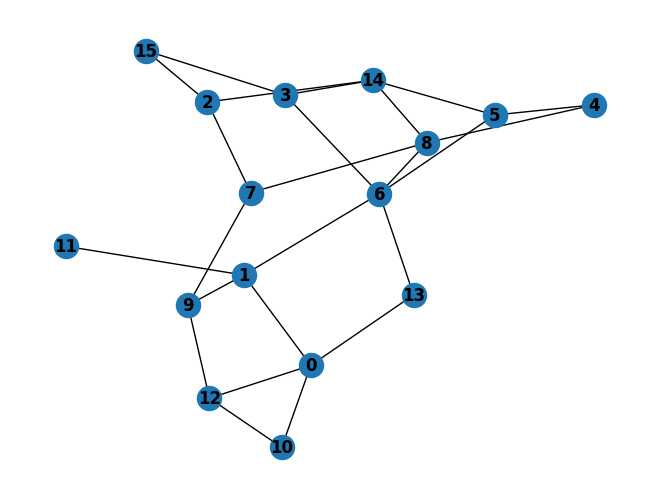

# Parallel ORbit Counter

This tool provides functionalities to perform orbit counting for a specified vertex.

## Installation

To use this tool, simply clone the repository:

```bash
git clone https://hpdc-gitlab.eeecs.qub.ac.uk/sitauhidi/porc.git
```

## Usage

Compile the code:

```bash
make
```

If you want the orbits to be explicitly enumerated, provide the `VERBOSE=1` flag during compilation.

```bash
make VERBOSE=1
```

Run the compiled executable with the following command:

```bash
./pORC <graph_file> <vertex_id>
```

Replace `<graph_file>` with the path to your graph file and `<vertex_id>` with the ID of the vertex for which you want to count orbits.

To clean the generated files run:

```bash
make clean
```

## File Format

The graph file should follow the following format:

- The file should start with a line specifying the total number of vertices and edges (start with 't').
- Each subsequent line represents either a vertex or an edge.
- Vertex lines start with 'v' followed by the vertex ID, label, and degree.
- Edge lines start with 'e' followed by the IDs of the vertices connected by the edge.

#### Example:



The graph file for the above graph is:

```
t 16 24
v 0 41 4
v 1 70 4
v 2 7 3
v 3 7 3
v 4 69 2
v 5 124 3
v 6 20 5
v 7 16 3
v 8 7 4
v 9 14 3
v 10 8 2
v 11 9 1
v 12 17 3
v 13 9 2
v 14 30 4
v 15 1 2
e 0 1
e 0 10
e 0 12
e 0 13
e 1 6
e 1 9
e 1 11
e 2 7
e 2 14
e 2 15
e 3 6
e 3 14
e 3 15
e 4 5
e 4 8
e 5 6
e 5 14
e 6 8
e 6 13
e 7 8
e 7 9
e 8 14
e 9 12
e 10 12
```

## Functions

- `readGraph`: Reads the graph from the specified file.
- `formatVF3`: Formats the graph in VF3 format for further processing.
- `preProcess`: Preprocesses the graph, sorting adjacency lists.
- `countOrbits`: Counts different types of orbits for a given vertex.
- `printGraph`: Prints the structure of the graph.
- `printOrbits`: Prints the counts of different types of orbits.

## Contributions

Contributions are welcome! If you find any bugs or want to suggest improvements, feel free to open an issue or create a pull request.
